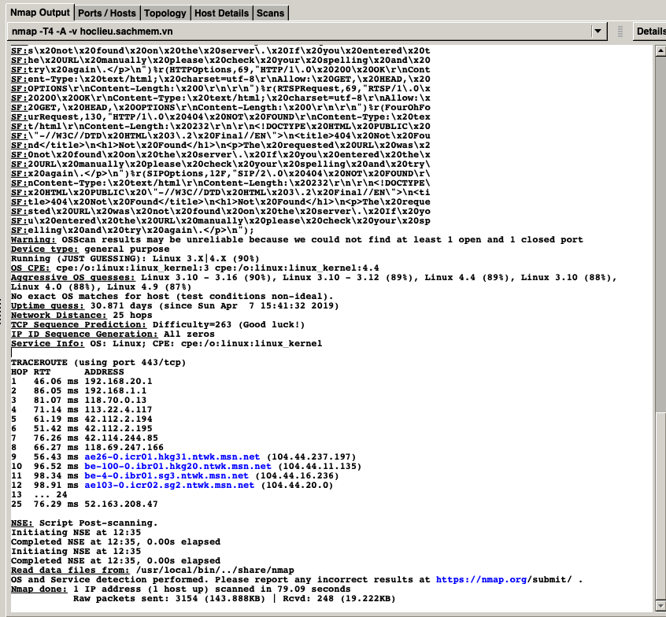
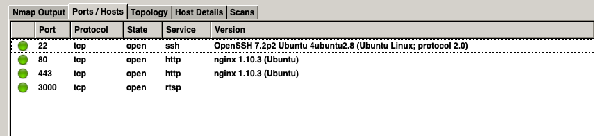
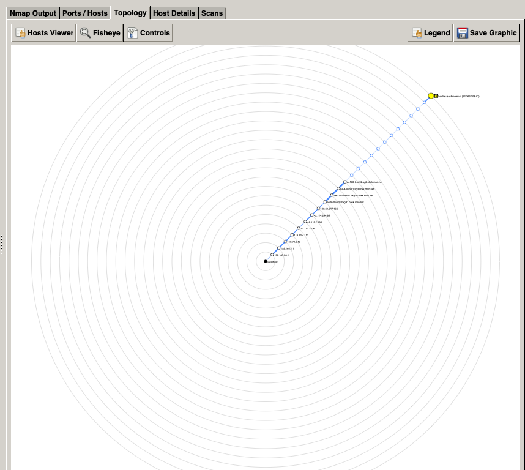

# **Hướng dẫn cài đặt và sử dụng NMap**
### **- Họ và tên: Phạm Ngọc Tài**
### **- MSV: 16021415**
### **- Lớp: K61-CA-CLC2**
## **NMap là 1 application scanner. Là 1 công củ để kiểm tra các lỗ hổng về bảo mật cho trang web của bạn Bao gồm các tính năng như:**
#### **+ Quét các cổng mạng (port scanning)**
#### **+ Lập bản đồ mạng (Network mapping)**
#### **+ Phát hiện hệ điều hành(OS detection)**
#### **+ Dò tìm dịch vụ (Service discovery)**
#### **+ Kiểm tra bảo mật (Security auditing) và nhiều dịch vụ khác nữa.**

## **Cài đặt **
### **Trước hết ta cần phải cài đặt NMap**
### **Vào trang chủ Nmap và tải app về https://nmap.org**
### **Sau đó tải file cài đặt tương ứng về và cài đặt vào máy**

## **Các bước thực hiệnt**

## **<u>Bước 1: Khởi động Zenmap - GUI của Nmap</u>**

## **<u>Bắt đầu việc kiểm thử Quét các cổng mạng (port scanning) trang web </u>**
#### **ví dụ: hoclieu.sachmem.vn**
#### **Dán vào box "Target" nội dung: "hoclieu.sachmem.vn"**
#### **Chọn Profile là "Intense Scan"**
#### **CLick button "Scan"**

## **<u>Bước 3: Đợi ZenMap Scan và phân tích kết quả nhận được</u>**
#### **Kết quả nhận được sẽ như sau: **

#### **Vì kết quả nhận được khá dài nên mình sẽ phân tích một vài phần quan trọng:**
#### **PORT     STATE SERVICE  VERSION**
#### **22/tcp   open  ssh      OpenSSH 7.2p2 Ubuntu 4ubuntu2.8 (Ubuntu Linux; protocol 2.0)**
#### **80/tcp   open  http     nginx 1.10.3 (Ubuntu)**
#### **443/tcp  open  ssl/http nginx 1.10.3 (Ubuntu)**
#### **3000/tcp open  rtsp**
#### **Vậy là có 4 cổng mở, sử dụng kết nối TCP, Chạy trên OS là Ubuntu và có webserver là Nginx**

#### **Các bạn có thể xem nhanh các cổng với tuỳ chọn sau:**

#### **Hoặc xem sơ đồ chuyển tiếp**

#### ** **

